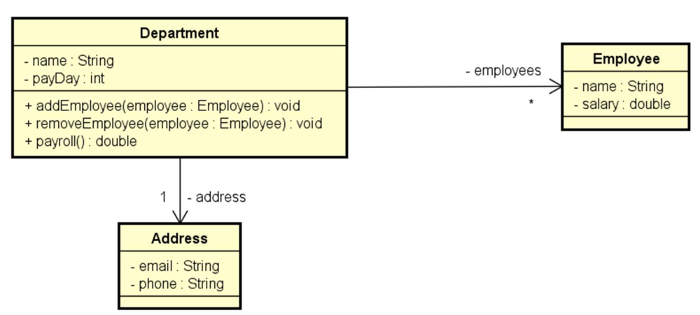
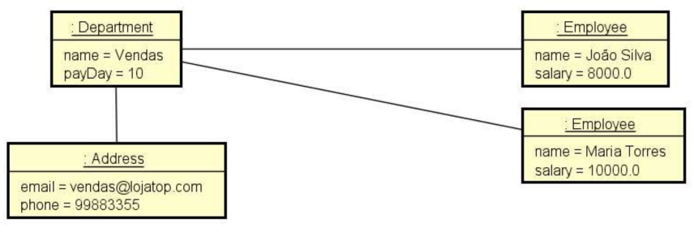

# 🎓 Desafio Empregados OO com C#

Este desafio faz parte de um exercício do curso **C# e Programação Orientada a Objeto Expert** da [DevSuperior](https://devsuperior.com.br/). O objetivo é treinar os conceitos de composição e estrutura de projetos estudado em aula.

## 📋 Enunciado

Você deve fazer um programa para ler os dados de um departamento, que inclui seu endereço e seus
empregados. Em seguida você deverá mostrar na tela um relatório de folha de pagamento, conforme
exemplos.
Para resolver este problema, você deverá implementar as entidades conforme projeto abaixo. O método
payroll() da classe Department é responsável por retornar o valor total da folha de pagamento do
departamento.

## 🛠️ Estrutura

A solução foi desenvolvida seguindo a arquitetura de Modelo de Domínio e ORM, conforme o diagrama abaixo:

### Diagrama de Classes



### Diagrama de Objetos



## 🏗️ Exemplo de saída no console

```text
Nome do departamento: Vendas
Dia do pagamento: 10
Email: vendas@lojatop.com
Telefone: 99883355
Quantos funcionários tem o departamento? 2
Dados do funcionário 1:
Nome: João Silva
Salário: 8000.00
Dados do funcionário 2:
Nome: Maria Torres
Salário: 10000.00

FOLHA DE PAGAMENTO:
Departamento Vendas = R$ 18000.00
Pagamento realizado no dia 10
Funcionários:
João Silva
Maria Torres
Para dúvidas favor entrar em contato: vendas@lojatop.com
```
